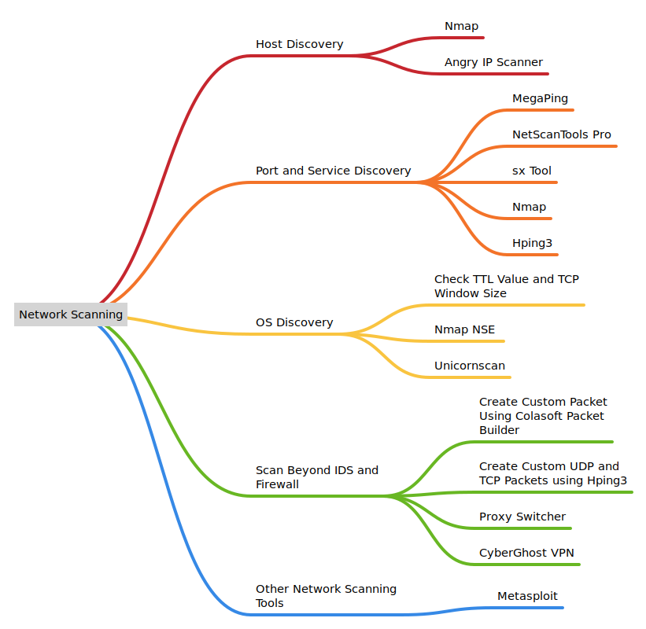

# 🔄 Network Scanning


Note: I have not provided the commands for the tools for simplicity. If you know exactly which tool to use in your ceh exam than you can search for specific commands related to the tool on the internet.


<figure><figcaption>
Network Scanning Mindmap
</figcaption></figure>

