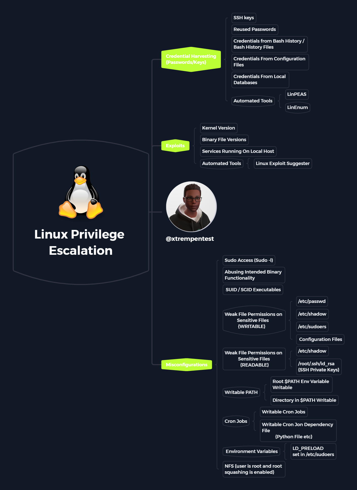

# 🏋♂ Privilege Escalation

## Basic Privilege Escalation

On Linux systems, services may be running as a non-root user. For e.g., by default, Apache and Nginx run as the user www-data. Therefore, even if a web application or the service itself is compromised, the attacker will only get access as the www-data user which has limited privileges. To gain full control of a system, it is important to escalate privileges from a user with low privileges to the root user (vertical escalation).&#x20;

It might not be always possible to escalate from the current user to the root user. In such cases, other users on the machine must be compromised (horizontal escalation), and then used to try to attain root privileges.&#x20;

### References

1. Privilege Escalation ([https://en.wikipedia.org/wiki/Privilege\_escalation](https://en.wikipedia.org/wiki/Privilege\_escalation))

### Priv Esc Mind-Map

<figure><figcaption>
Privilege escalation mindmap
</figcaption></figure>

